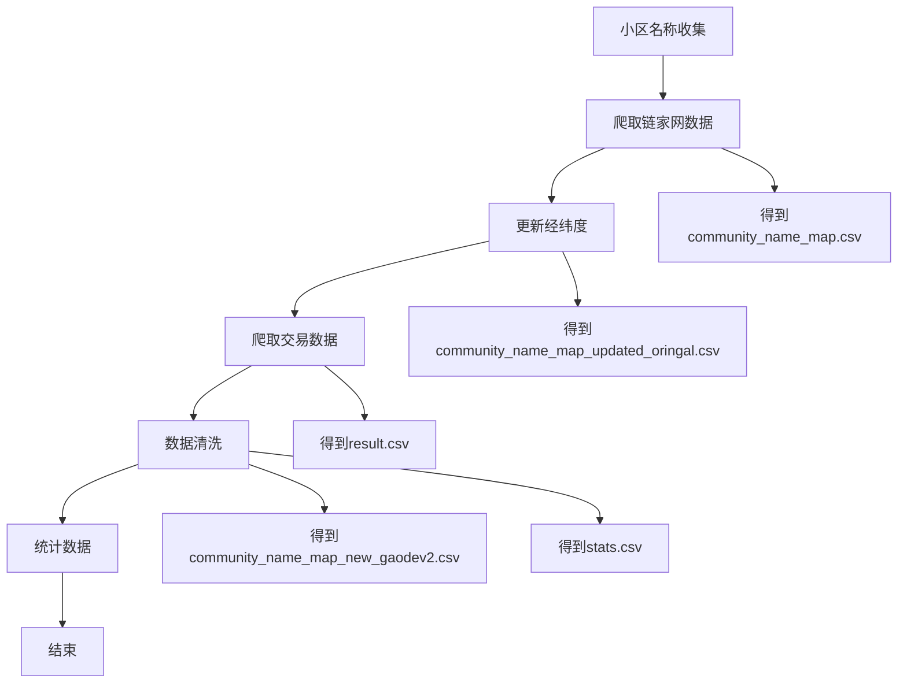

[TOC]

# 代码说明

<font color='red'>**课程论文中的所有图片和数据，以及数据处理的代码，都存储在文件夹中**</font>

# 二手房交易信息获取

大致流程


数据文件流



### 小区名称收集

使用python爬虫在[链家网](https://hz.lianjia.com/xiaoqu/daguan/pg2cro21/)上搜索了上城，拱墅, 西湖三个区的所有商品房交易房源， 得到`community_name_map.csv`

### 经纬度查询

使用腾讯地图的API，开启配额后填入key即可。 程序运行完后，`community_name_map.csv`得到了`community_name_map_updated_oringal.csv`


程序运行后，显示大致如下


### 爬取交易数据

复制一份`community_name_map_updated_oringal`并且命名为`community_name_map_updated.csv`用来进行自动化的爬取时记录哪些已经被爬取过了

运行`scraper.py`就可以根据`community_name_map_updated.csv`里面的住宅小区名称在[杭州市二手房数据](https://ershoufangdata.com/index.html?city=hz)进行二手房交易数据的爬取， 爬取后得到的交易数据存储为`result.csv`(63,523条数据)，并且我们发现`community_name_map_updated.csv`中有部分房产没有交易记录，我们把这些移除后得到了`community_name_map.csv`

`运行效果.mp4`可以展示程序运行时的大致效果

### 数据清洗

此时由于调用腾讯地图API时有部分区域的经纬度查询有一定问题，造成部分地址实际上是重合的，我们找出这些位置后，手动重新查询了位置填入了经纬度，更新得到了`community_name_map_new.csv` 

在这个过程中发现之前用腾讯API查询的地址许多都有偏移，因此改用高德API重新进行了查询得到`community_name_map_new_gaode.csv`, 再用`clean.py`进行清洗得到了`community_name_map_new_gaodev2.csv`

以`太和广场`为例，在[经纬度查询平台](https://lbs.amap.com/tools/picker)上查询，可以发现腾讯API查询得到的经纬度地址存在一定的问题


### 数据清洗

通过绘制后还是发现有些区域超出了杭州市区，这些点应该是查询有问题


把过于偏西的重新检查去除后发现还有一些点在钱塘江南


删除异常点后得到


使用`stats.py`对数据（综合`resultv2.csv`和`community_name_map_new_gaodev2.csv`）进行统计，最后得到了`stats.csv`文件，其格式为如下

| District | Street | Community        | Longitude | Latitude | AveragePrice | StdDeviationPrice | MaxPrice | MinPrice | 2013AvgPrice | 2014AvgPrice | 2015AvgPrice | 2016AvgPrice | 2017AvgPrice | 2018AvgPrice | 2019AvgPrice | 2020AvgPrice | 2021AvgPrice | 2022AvgPrice |
| -------- | ------ | ---------------- | --------- | -------- | ------------ | ----------------- | -------- | -------- | ------------ | ------------ | ------------ | ------------ | ------------ | ------------ | ------------ | ------------ | ------------ | ------------ |
| 上城     | 九堡   | 头格江景家园一区 | 120.3058  | 30.30068 | 24977.6      | 1797.633          | 26811    | 21936    | 0            | 0            | 0            | 0            | 0            | 25421.5      | 24373.5      | 25298        | 0            | 0            |
| 临平     | 乔司   | 朗诗未来街区东园 | 120.3032  | 30.36286 | 26653.77     | 2267.356          | 31543    | 19413    | 0            | 0            | 0            | 0            | 22511.5      | 24667.25     | 26459.5      | 27667.19     | 0            | 0            |

# 商场数据

[商圈数据](https://data.wgly.hangzhou.gov.cn/home/#/themeData/businessdistrict)

可以改为商城的影响，怎么定义商场的影响力，可以看它的营业额


# OLS 分析

`market/OLS.py` 

# GWR 分析

`market/GWR.py`

运行后输出为

```shell
===========================================================================
Model type                                                         Gaussian
Number of observations:                                                2229
Number of covariates:                                                     5

Global Regression Results
---------------------------------------------------------------------------
Residual sum of squares:                                       250954322872.753
Log-likelihood:                                                  -23824.784
AIC:                                                              47659.568
AICc:                                                             47661.606
BIC:                                                           250954305727.251
R2:                                                                   0.293
Adj. R2:                                                              0.292

Variable                              Est.         SE  t(Est/SE)    p-value
------------------------------- ---------- ---------- ---------- ----------
X0                               14095.589   1122.659     12.556      0.000
X1                                  -0.054      0.037     -1.461      0.144
X2                                 652.093     22.237     29.325      0.000
X3                                  -0.958      5.834     -0.164      0.870
X4                                4732.037    379.047     12.484      0.000

Geographically Weighted Regression (GWR) Results
---------------------------------------------------------------------------
Spatial kernel:                                           Adaptive bisquare
Bandwidth used:                                                      62.000

Diagnostic information
---------------------------------------------------------------------------
Residual sum of squares:                                       101816653884.295
Effective number of parameters (trace(S)):                          344.516
Degree of freedom (n - trace(S)):                                  1884.484
Sigma estimate:                                                    7350.438
Log-likelihood:                                                  -22819.397
AIC:                                                              46329.826
AICc:                                                             46457.027
BIC:                                                              48302.483
R2:                                                                   0.713
Adjusted R2:                                                          0.661
Adj. alpha (95%):                                                     0.001
Adj. critical t value (95%):                                          3.384

Summary Statistics For GWR Parameter Estimates
---------------------------------------------------------------------------
Variable                   Mean        STD        Min     Median        Max
-------------------- ---------- ---------- ---------- ---------- ----------
X0                    21471.625  35104.375 -122982.527  22904.862 252401.768
X1                        3.216     56.549  -1104.387      0.263    324.959
X2                       39.121   3457.377 -34259.068     86.927  25864.919
X3                       25.299     62.906   -285.464     15.962    293.114
X4                     4798.222   5073.040 -13196.365   4669.543  23793.806
===========================================================================

None

Process finished with exit code 0
```

# 时间序列分析

`time_series/GAK.py`就会输出三种分析方式的结果，存为`csv`文件
