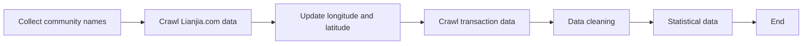
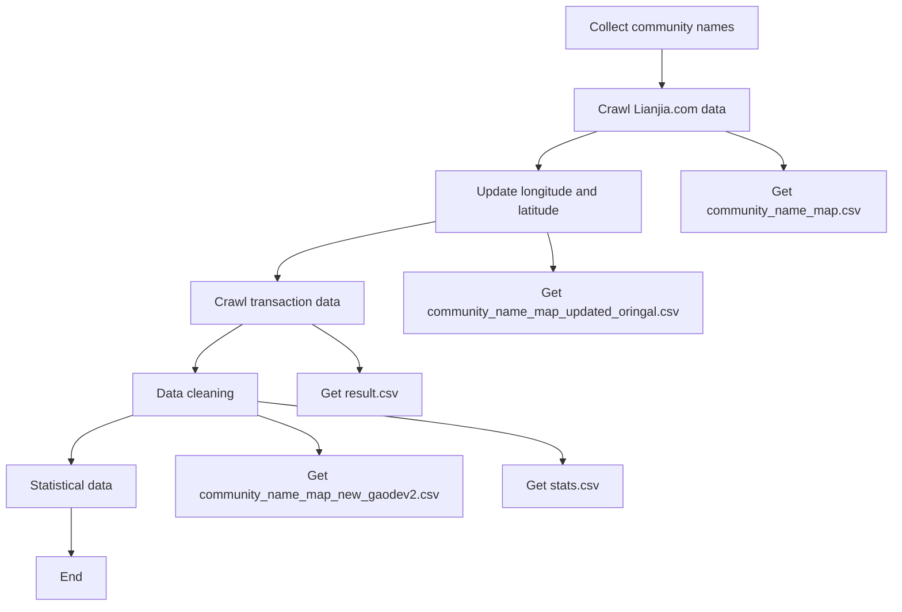
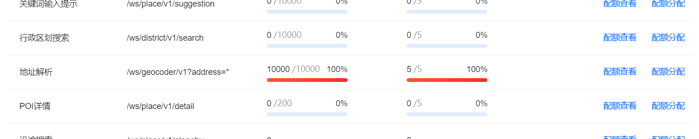
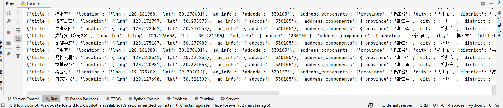
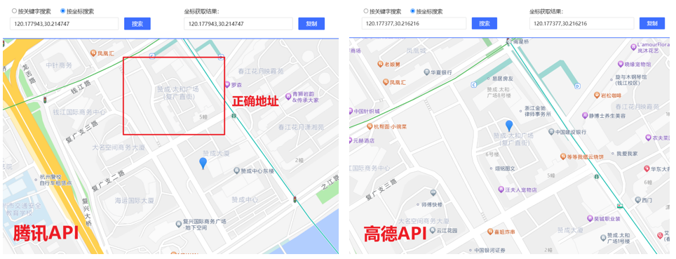
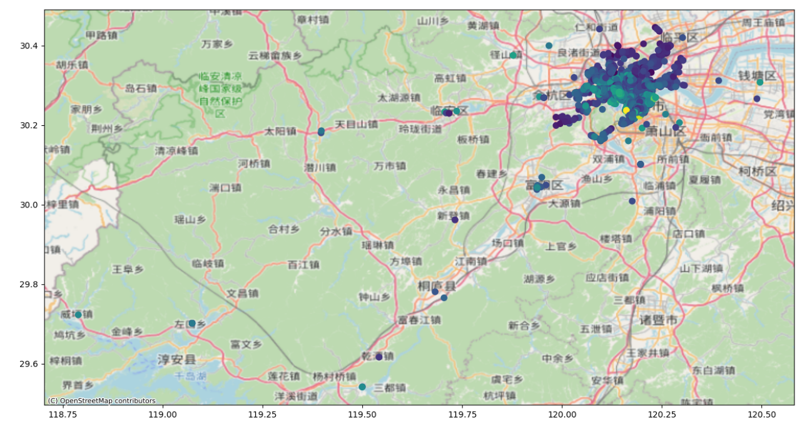
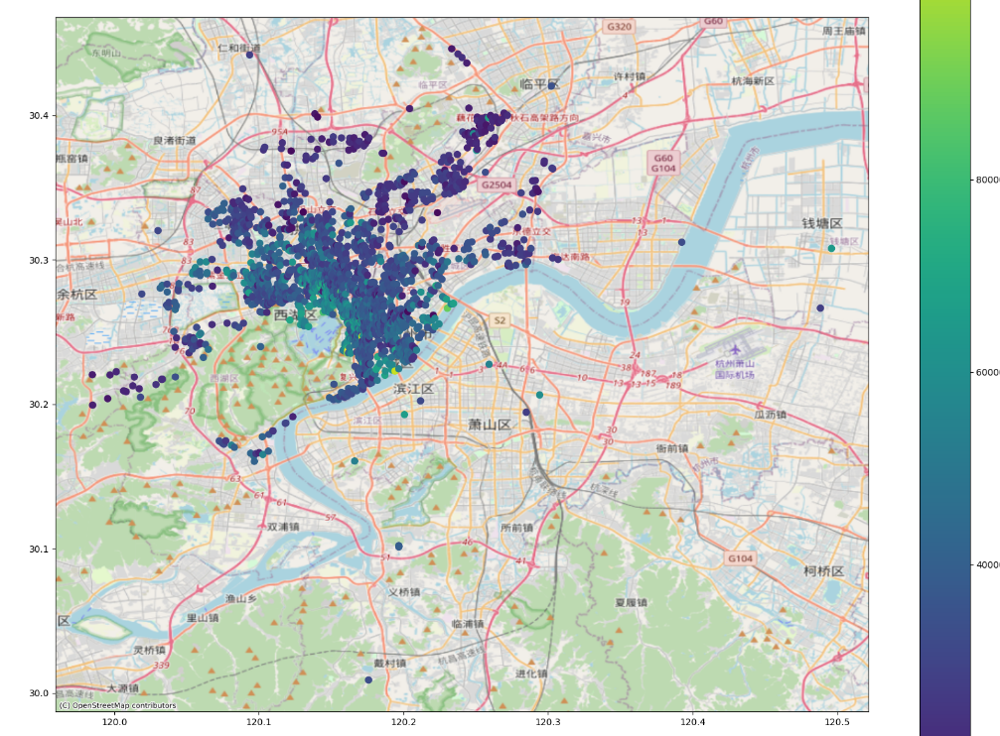
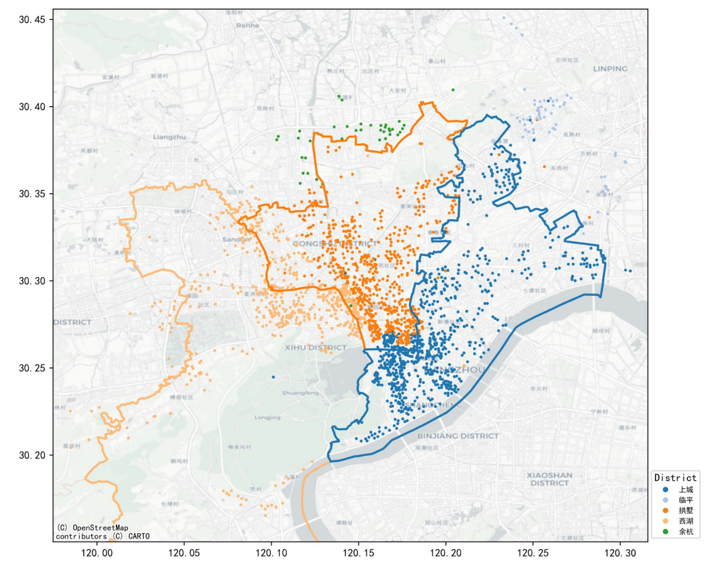
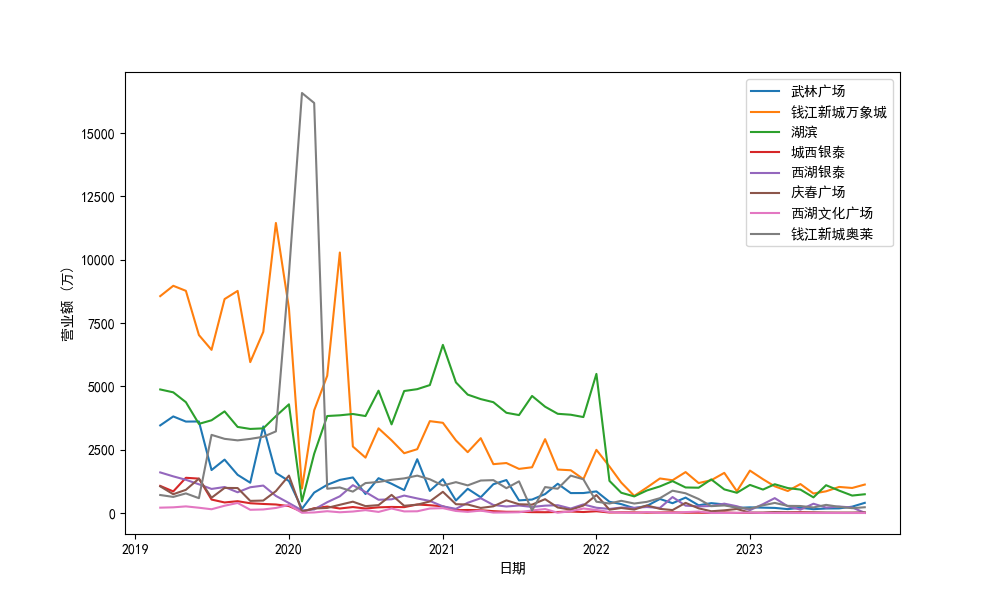

[TOC]

# Code Description

<font color='red'>**All images and data in the course paper, as well as the data processing code, are stored in the folder**</font>

# Obtaining second-hand housing transaction information

General process



Data file stream



### Community name collection

Use python crawler to search all commercial housing transaction sources in Shangcheng, Gongshu, and Xihu districts on [Lianjia.com](https://hz.lianjia.com/xiaoqu/daguan/pg2cro21/), and get `community_name_map.csv`

### Longitude and latitude query

Use Tencent Map API, open the quota and fill in the key. After the program is run, `community_name_map.csv` gets `community_name_map_updated_oringal.csv`



After the program runs, the display is roughly as follows



### Crawl transaction data

Copy a copy of `community_name_map_updated_oringal` and name it `community_name_map_updated.csv` to record what has been crawled during automated crawling

Run `scraper.py` to crawl second-hand housing transaction data from [Hangzhou second-hand housing data](https://ershoufangdata.com/index.html?city=hz) based on the residential community names in `community_name_map_updated.csv`. The transaction data obtained after crawling is stored as `result.csv` (63,523 data items), and we found that some properties in `community_name_map_updated.csv` have no transaction records. We removed these and got `community_name_map.csv`

`Running effect.mp4` can show the general effect of the program when it is running

### Data cleaning

At this time, due to some problems in the longitude and latitude query of some areas when calling the Tencent Map API, some addresses actually overlap. After we found these locations, we manually re-queried the locations and filled in the longitude and latitude, and updated `community_name_map_new.csv`

In this process, I found that many of the addresses previously queried using Tencent API had offsets, so I used Amap API to requery and obtained `community_name_map_new_gaode.csv`, and then used `clean.py` to clean it and obtained `community_name_map_new_gaodev2.csv`

Take `Taihe Square` as an example, and query on the [latitude and longitude query platform](https://lbs.amap.com/tools/picker), it can be found that the latitude and longitude addresses obtained by Tencent API query have certain problems



### Data Cleaning

After drawing, it is still found that some areas are beyond the urban area of Hangzhou. These points should be query problems



After rechecking and removing the points that were too far west, we found that there were still some points south of Qiantang River.



After removing the outliers, we get



Use `stats.py` to count the data (combined `resultv2.csv` and `community_name_map_new_gaodev2.csv`), and finally get the `stats.csv` file, the format of which is as follows

| District  | Street | Community                      | Longitude | Latitude | AveragePrice | StdDeviationPrice | MaxPrice | MinPrice | 2013AvgPrice | 2014AvgPrice | 2015AvgPrice | 2016AvgPrice | 2017AvgPrice | 2018AvgPrice | 2019AvgPrice | 2020AvgPrice | 2021AvgPrice | 2022AvgPrice |
| --------- | ------ | ------------------------------ | --------- | -------- | ------------ | ----------------- | -------- | -------- | ------------ | ------------ | ------------ | ------------ | ------------ | ------------ | ------------ | ------------ | ------------ | ------------ |
| Shangchen | Jiubao | Touge Riverview Home Area 1    | 120.3058  | 30.30068 | 24977.6      | 1797.633          | 26811    | 21936    | 0            | 0            | 0            | 0            | 0            | 25421.5      | 24373.5      | 25298        | 0            | 0            |
| Linping   | Qiaosi | Landsea Future Block East Park | 120.3032  | 30.36286 | 26653.77     | 2267.356          | 31543    | 19413    | 0            | 0            | 0            | 0            | 22511.5      | 24667.25     | 26459.5      | 27667.19     | 0            | 0            |

# Mall data

[Mall data in gov website](https://data.wgly.hangzhou.gov.cn/home/#/themeData/businessdistrict)

# OLS analysis

`market/OLS.py` 

# GWR analysis

`market/GWR.py`

运行后输出为

```shell
===========================================================================
Model type                                                         Gaussian
Number of observations:                                                2229
Number of covariates:                                                     5

Global Regression Results
---------------------------------------------------------------------------
Residual sum of squares:                                       250954322872.753
Log-likelihood:                                                  -23824.784
AIC:                                                              47659.568
AICc:                                                             47661.606
BIC:                                                           250954305727.251
R2:                                                                   0.293
Adj. R2:                                                              0.292

Variable                              Est.         SE  t(Est/SE)    p-value
------------------------------- ---------- ---------- ---------- ----------
X0                               14095.589   1122.659     12.556      0.000
X1                                  -0.054      0.037     -1.461      0.144
X2                                 652.093     22.237     29.325      0.000
X3                                  -0.958      5.834     -0.164      0.870
X4                                4732.037    379.047     12.484      0.000

Geographically Weighted Regression (GWR) Results
---------------------------------------------------------------------------
Spatial kernel:                                           Adaptive bisquare
Bandwidth used:                                                      62.000

Diagnostic information
---------------------------------------------------------------------------
Residual sum of squares:                                       101816653884.295
Effective number of parameters (trace(S)):                          344.516
Degree of freedom (n - trace(S)):                                  1884.484
Sigma estimate:                                                    7350.438
Log-likelihood:                                                  -22819.397
AIC:                                                              46329.826
AICc:                                                             46457.027
BIC:                                                              48302.483
R2:                                                                   0.713
Adjusted R2:                                                          0.661
Adj. alpha (95%):                                                     0.001
Adj. critical t value (95%):                                          3.384

Summary Statistics For GWR Parameter Estimates
---------------------------------------------------------------------------
Variable                   Mean        STD        Min     Median        Max
-------------------- ---------- ---------- ---------- ---------- ----------
X0                    21471.625  35104.375 -122982.527  22904.862 252401.768
X1                        3.216     56.549  -1104.387      0.263    324.959
X2                       39.121   3457.377 -34259.068     86.927  25864.919
X3                       25.299     62.906   -285.464     15.962    293.114
X4                     4798.222   5073.040 -13196.365   4669.543  23793.806
===========================================================================

None

Process finished with exit code 0
```

# Time series analysis

`time_series/GAK.py` will output the results of three analysis methods and save them as `csv` files


